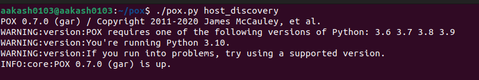
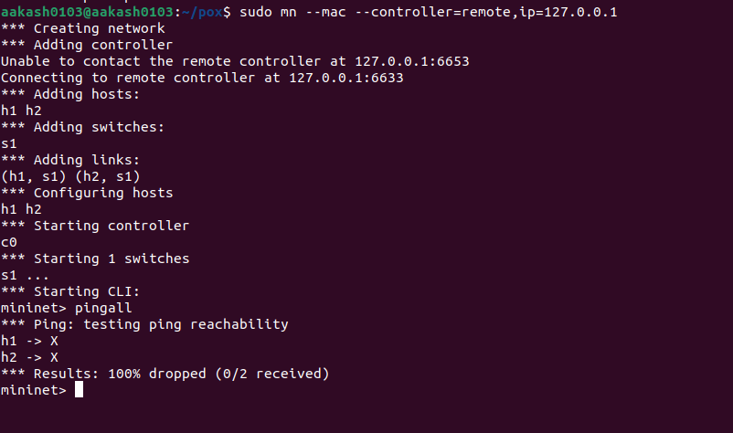
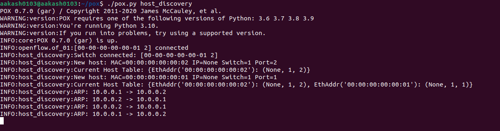
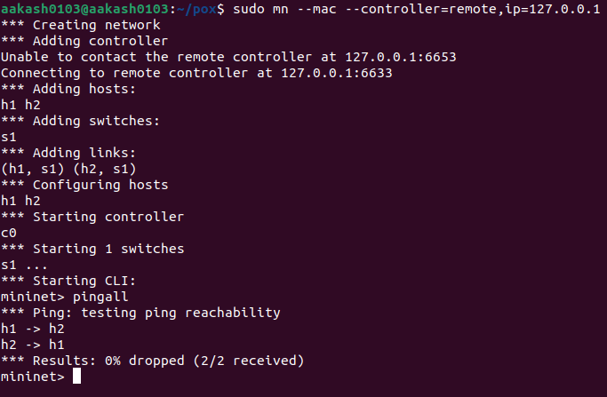
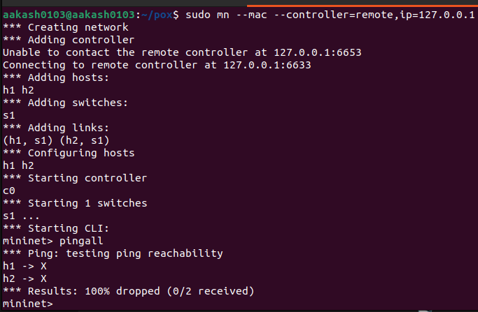
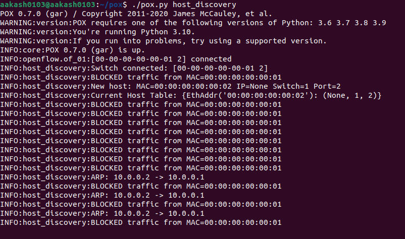
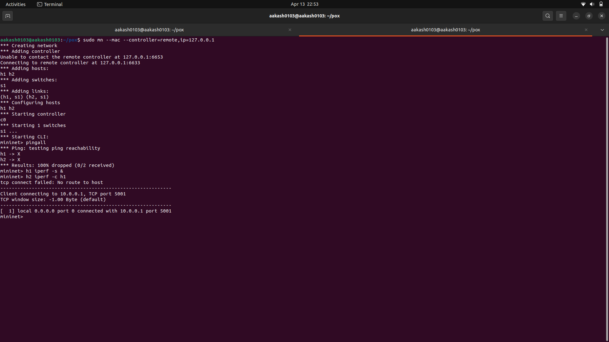
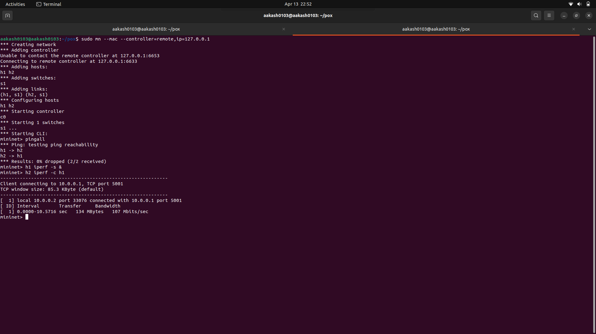

# SDN Host Discovery Service using POX

## 📌 Problem Statement

Implement a Host Discovery Service in an SDN network that:

* Detects host join events
* Maintains a host database
* Displays host details
* Updates dynamically

---

## ⚙️ Technologies Used

* Mininet
* POX Controller
* Python

---

## 🚀 How to Run

### Step 1: Start Controller

```bash
cd ~/pox
./pox.py host_discovery
```

### Step 2: Start Mininet

```bash
sudo mn -c
sudo mn --mac --controller=remote,ip=127.0.0.1
```

### Step 3: Test

```bash
pingall
```

---

## 🧠 Features Implemented

* Host discovery using PacketIn events
* MAC to port mapping
* Dynamic host table maintenance
* ARP packet inspection
* Logging of host details

---

## 🔥 Additional Feature

Firewall implementation:

* Blocks traffic from a specific MAC address
* Demonstrates SDN match-action logic

---

## 🧪 Test Scenarios

### 1. Normal Communication

* All hosts communicate successfully
* Output: 0% packet loss

### 2. Blocked Host

* One host is blocked
* Output: 100% packet loss

---
## 📸 Screenshots

### 🔹 Controller Running


### 🔹 Host Discovery


### 🔹 ARP Logs


### 🔹 Normal Ping (All Hosts Reachable)


### 🔹 Blocked Host Ping


### 🔹 Firewall Logs


### 🔹 Iperf Blocked


### 🔹 Iperf Success

## 📸 Sample Output

* Host discovery logs
* Host table updates
* Packet loss during blocking

---

## 🎯 Conclusion

The project successfully demonstrates dynamic host discovery and SDN-based traffic control using a centralized controller.

---
